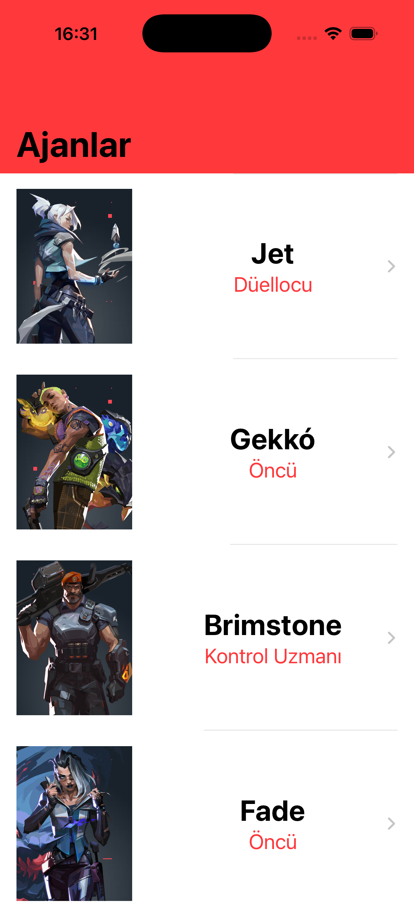
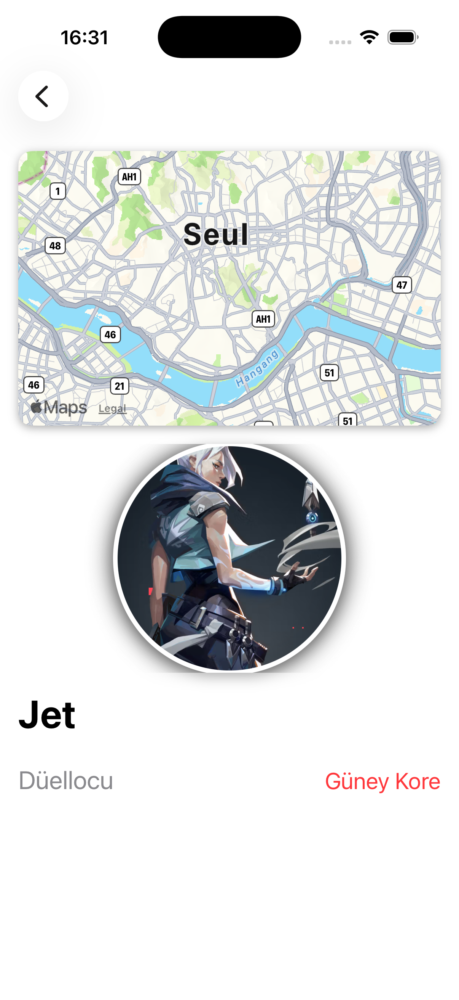

# Valorant Agents – SwiftUI

A SwiftUI application that showcases Valorant agents with detailed views,
including agent information, circular avatars, and real-world locations
displayed using MapKit.

This project is built with a clean and modern SwiftUI approach, focusing on
reusable components and readable architecture.

---

## Features
- SwiftUI native UI
- Agent list and detail views
- Circular avatar component
- Real-world agent locations displayed on map
- Reusable and clean UI components
- Mock data for fast development and previews

---

## Screenshots

  
  

---

## Technologies
- SwiftUI
- MapKit
- CoreLocation

---

## Project Structure
- `Models` – Agent, coordinate, and mock data
- `Views` – List, detail, and reusable UI components
- `MapView` – SwiftUI native Map integration

---

## Author
**Muhammed Yasir Bilir**  
🌐 https://www.yasirbilir.com  
🔗 GitHub & LinkedIn links available on the website
